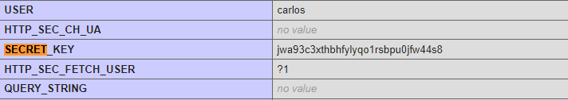

# [Lab: Information disclosure  on debug page
](https://portswigger.net/web-security/information-disclosure/exploiting/lab-infoleak-on-debug-page)

This lab contains a debug page that discloses sensitive information about the application. To solve the lab, obtain and submit the `SECRET_KEY` environment variable.

---
## Solution

- do active scan on target
- you will get `/cgi-bin/phpinfo.php`
- visit the path
- 